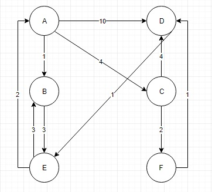

# Delivery​ ​Service 

This project is a delivery cost calculator based on graph data structure.



## Getting Started


## Installing

Please install client side requirements by using this command

```
$ npm install
```

To add some dummy data to the project, state is set with the above graph

## Usage

to start the project please run the below command

```
$ npm start
```

### Built With
* [React](https://reactjs.org/) - Used in front-end to build user interface
* [Blueprint](https://reactjs.org/) - A React-based UI toolkit to make UI more beautiful
* [Redux](https://redux.js.org/) - A state management for JavaScript Appps
* [Redux Form](https://reactjs.org/) - Managing the form state in Redux

## Authors

See the list of [contributors](https://github.com/sheidaee/time-tracker/contributors) who participated in this project.

## License

This project is licensed under the MIT License - see the [LICENSE.md](LICENSE.md) file for details.